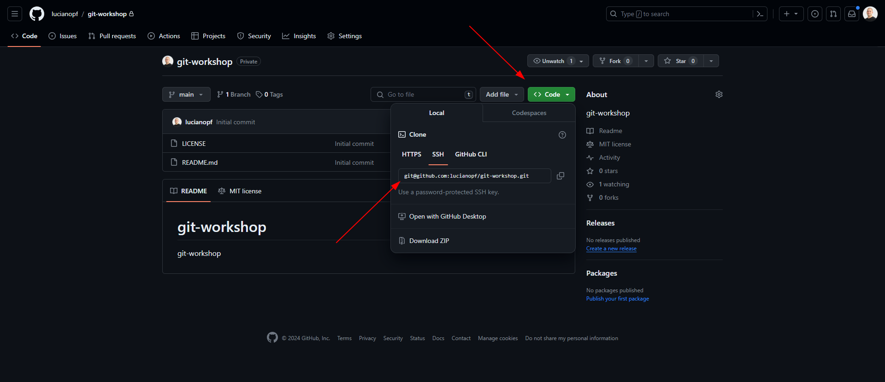

# Aula 1 (fork, clone e trocar de branches)

Nessa primeira aula iremos abordar como será a estutura do curso e o como iremos seguir com as aulas.

Para iniciar o curso é necessário criar um fork do repositório e após isso clonar em seu computador.

1. Clicar no botão fork no canto superior direito

2. Clicar no botão Code e copiar o link para clonar (repare que estou usando ssh e não http porém para nosso curso não fará diferença)

3. Com esa URL em mãos deve-se abrir o terminal e executar o comando `git clone <URL>` e isso irá criar uma nova pasta onde vc está com o nome `git-workshop`.

4. Agora devemos entrar na pasta com `cd git-workshop`.

Agora estamos numa cópia local de um fork de um repositório onde temos total liberdade para interagir e fazer o que quiser. Repare que agora temos uma pasta dentro da atual chamada `.git` e essa pasta é onde o git guarda todas as informações do repositório localmente.

Nesse repositório temos diversas branches já criadas e cada uma representa uma aula do curso.

Para navegar entre as branches podemos usar o comando `git checkout <branch>` e para listar todas as branches podemos usar o comando `git branch`.

Para iniciar a aula 2 devemos executar o comando `git checkout lesson-2` e lá teremos no README a referencia pra próxima aula.