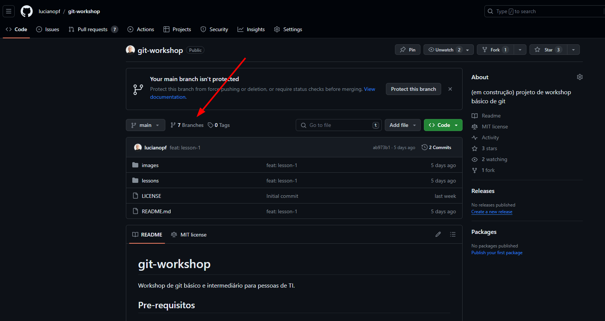
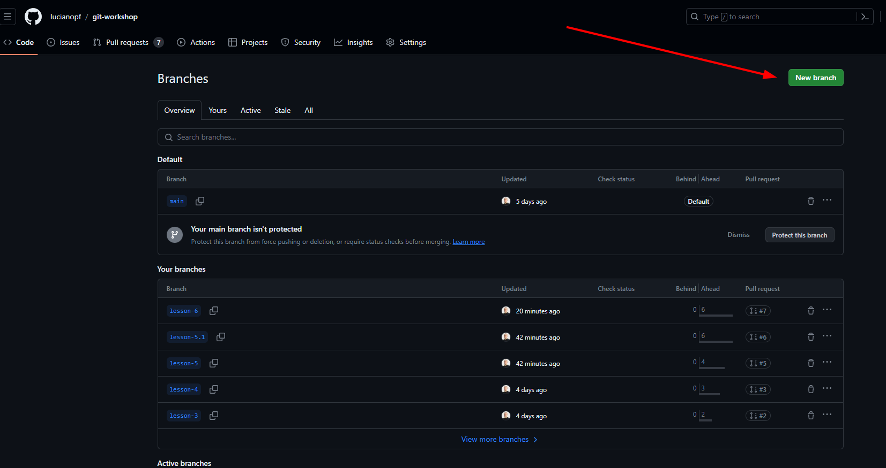
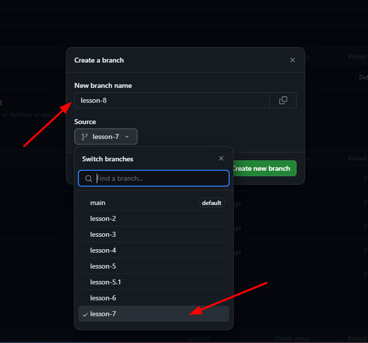

# Aula 7 (fetch, pull)

Quando trabalhamos em conjunto com outras pessoas, é comum o estado remoto do repositório mude. Então, precisamos atualizar o nosso repositório local com as mudanças do repositório remoto.
Pra isso podemos usar os comandos `fetch` e `pull`.

**No fim desse arquivo teremos um exercício prático antes de seguir para a próxima aula.**

## Fetch

O comando `fetch` nos permite atualizar o estado local com o estado remoto, sem realizar `merge` ou `rebase` na branch atual.
Assim como os demais comandos, o `git fetch` também tem suas variações. A que mais utilizo, é a `git fetch --all`, que garante a atualização de todas as referencias entre nosso repositório local e o remoto.

Obs: apesar de não termos abordado até o momento, é possível e bem comum termos mais de um repositório remoto. Por exemplo, o original e o seu `fork`. 

Uso: 
```bash
git fetch --all
```

## Pull

O comando git pull é um atalho para o comando `git fetch` seguido do comando `git merge FETCH_HEAD` que faz o merge da branch atual com a branch remota.
Esse comando é frequentemente usado pra atualizar o repositório local com as mudanças do repositório remoto especialmente em casos onde temos interações externas com a branch em que voce está trabalhando.

Por exemplo: uma automação fez um commit automático ou algum outro colega adicionou mudanças na branch que você está trabalhando.

Assim como os demais comandos, esse também tem suas variações. A que mais utilizo é a `git pull --rebase`, que faz o `rebase` da `branch` atual com a `branch` remota. (caso não seja passado a flag `rebase` será feito um merge ao invés de rebase).

Obs: se ainda não ficou claro a diferença entre merge e rebase, de uma breve relida na [aula 4](./lesson-4.md).

Documentação mais avançada: https://git-scm.com/docs/git-pull/pt_BR


# Prática 7

Como estamos seguindo com o curso de forma individual e não temos ninguém pra fazer alterações no nosso repositório remoto vamos simular uma alteração externa no nosso repositório remoto pela interface do Github.
No momento temos a branch `lesson-eight` que está com nome incompatível com as demais branches e devemos criar uma nova branch chamada `lesson-8` (dessa vez via interface do Github), fazer um fetch dessa branch e trazer os commits da branch `lesson-eight` para a branch `lesson-8`.

Para isso precisamos fazer o seguinte:
1. Vamos criar uma nova branch chamada `lesson-8` via interface do Github.




2. Agora que criamos a branch `lesson-8` apenas no repositório remoto precisamos atualizar nossa referencia local pra reconhecer essa nova branch, pra isso vamos executar o comando `git fetch --all` e depois `git branch -a` pra visualizar todas as branches locais e remotas.

3. Agora que temos a branch `lesson-8` no repositório local precisamos trazer os commits da branch `lesson-eight` para a branch `lesson-8`, pra isso vamos executar o comando `git pull --rebase origin lesson-eight` e depois `git log --oneline` pra visualizar os commits.

Obs: O passo 3 também poderia ser feito com `cherry-pick`, mas como estamos seguindo a ordem do curso vamos usar o `pull --rebase` pra trazer os commits da branch `lesson-eight` pra branch `lesson-8`.

--- 

Podemos seguir para a próxima aula na branch `lesson-8`.